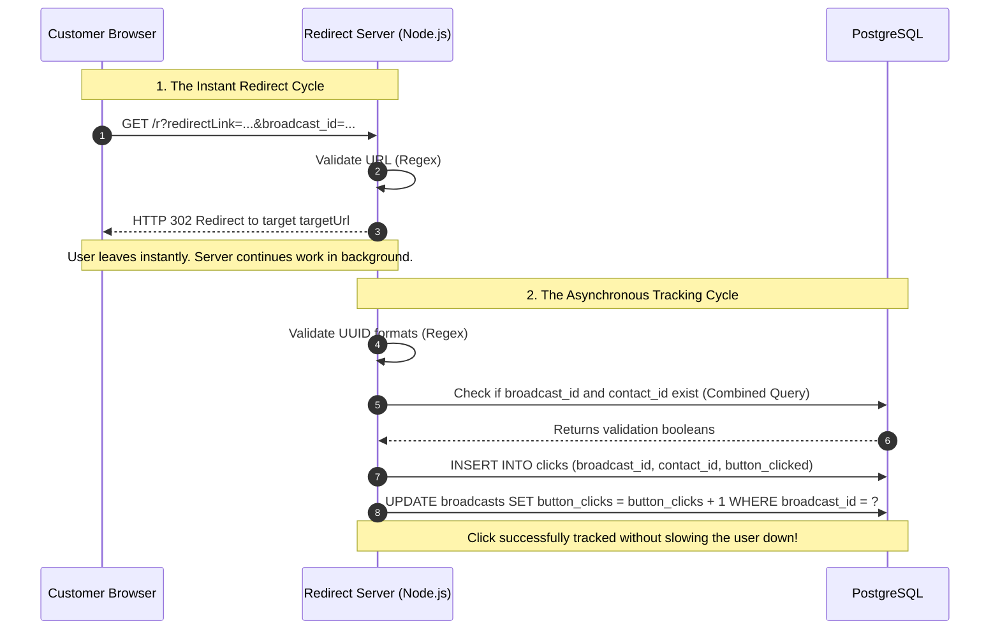

# Architecture Design: Zero-Latency WhatsApp Link Redirector & Tracker

**Component:** Redirection & Tracking Microservice

**Objective:** To capture link clicks from WhatsApp message buttons, redirect the user to a Shopify destination with absolute minimal latency, and asynchronously log the click attribution in the database using a fire-and-forget pattern.

---

## 1. System Architecture & Data Flow

### The "Fire-and-Forget" Pattern

Standard web requests block the user's browser until the server finishes writing to the database. For link redirects, this causes a noticeable delay (latency) which degrades the user experience.

To achieve a "zero-latency" feel, this service decouples the HTTP response cycle from the database transaction cycle. The server instantly returns an `HTTP 302 Found` redirect to the user's browser, and *then* hands the database validation and insertion tasks to a background thread within the Node.js event loop.

### Sequence Diagram



---

## 2. Technology Stack & Infrastructure

* **Runtime:** Node.js (Event-driven, non-blocking I/O is perfect for the fire-and-forget pattern).
* **Web Framework:** Express.js (Lightweight routing).
* **Database:** PostgreSQL.
* **Driver:** `pg` (Node-Postgres) configured with **Connection Pooling**.
* *Why Pooling?* Ensures the server maintains a steady pool of open connections to the DB (e.g., 20 max connections). If a broadcast is sent to 10,000 people and 500 click at the exact same second, the server will queue the background tasks safely without overwhelming the database or crashing the app.


---

## 3. Database Schema & Queries

### Relevant Schema: `clicks` Table

```sql
CREATE TABLE IF NOT EXISTS clicks (
  click_id UUID PRIMARY KEY DEFAULT gen_random_uuid(),
  broadcast_id UUID REFERENCES broadcasts(broadcast_id) ON DELETE CASCADE,
  contact_id UUID REFERENCES contacts(contact_id) ON DELETE CASCADE,
  button_clicked VARCHAR(255), 
  clicked_at TIMESTAMP WITH TIME ZONE DEFAULT CURRENT_TIMESTAMP
);

CREATE INDEX idx_clicks_broadcast ON clicks(broadcast_id);
CREATE INDEX idx_clicks_contact_id ON clicks(contact_id);

```

### Query 1: Single-Trip Validation

Instead of running two separate `SELECT` queries to verify the broadcast and contact, the server uses a combined `EXISTS` query. This cuts network latency to the database in half.

```sql
SELECT 
  (SELECT EXISTS(SELECT 1 FROM broadcasts WHERE broadcast_id = $1)) as valid_broadcast,
  (SELECT EXISTS(SELECT 1 FROM contacts WHERE contact_id = $2)) as valid_contact;

```

### Query 2: Click Insertion

```sql
INSERT INTO clicks (broadcast_id, contact_id, button_clicked) 
VALUES ($1, $2, $3);

```

### Query 3: Broadcast Counter Update

```sql
UPDATE broadcasts
SET button_clicks = COALESCE(button_clicks, 0) + 1
WHERE broadcast_id = $1;

```

---

## 4. API Documentation

### `GET /r`

**Description:** The primary redirection endpoint. Designed to be as short as possible to save characters in WhatsApp message templates.

#### Expected Query Parameters

| Parameter | Type | Required | Description |
| --- | --- | --- | --- |
| `redirectLink` | URL String | Yes | The final destination URL (e.g., `[https://your-shopify-store.com/sale](https://your-shopify-store.com/sale)`). |
| `broadcast_id` | UUID | Yes | The ID of the WhatsApp broadcast campaign. |
| `contact_id` | UUID | Yes | The internal ID of the customer who clicked the link. |
| `button_text` | String | No | The text written on the WhatsApp button (URL encoded). |

#### Example Request

```http
GET /r?redirectLink=https://store.com/discount&broadcast_id=123e4567-e89b-12d3-a456-426614174000&contact_id=987f6543-e21b-34d1-b654-426614174999&button_text=Shop%20Now

```

#### Expected Responses

* **`302 Found` (Success)**
* **Behavior:** The user is immediately redirected to the `redirectLink`.
* **Headers:** `Location: <redirectLink>`


* **`400 Bad Request`**
* **Behavior:** Returned only if the `redirectLink` parameter is missing or malformed (not a valid HTTP/HTTPS URL), and no environment fallback URL is configured. The click is still tracked before the error response is sent.


---

## 5. Performance & Reliability Expectations

To ensure production stability, the architecture incorporates the following safeguards:

1. **Pre-Flight Regex Validation:** Before the server attempts to query the database, it validates that `broadcast_id` and `contact_id` are strictly formatted UUIDs. If a bot scrapes the link and alters the IDs, the background task aborts immediately without wasting a database connection.
2. **Safe Error Swallowing:** Because the database work runs asynchronously outside the HTTP response, any database failures (e.g., connection timeouts, foreign key violations) are wrapped in a `try/catch` block. They log to the server console but **do not crash the Node process** and **do not show errors to the user**.
3. **URL Decoding:** The `button_text` parameter is safely decoded (`decodeURIComponent`) to ensure spaces (e.g., `%20`) are stored correctly as plain text in the database.
4. **Broadcast Counter Update:** Each successful tracked hit increments `broadcasts.button_clicks` by 1 using the incoming `broadcast_id`.
5. **Mandatory Client Release:** The connection pool client is always released in a `finally` block, ensuring no memory leaks occur during high-traffic spikes.