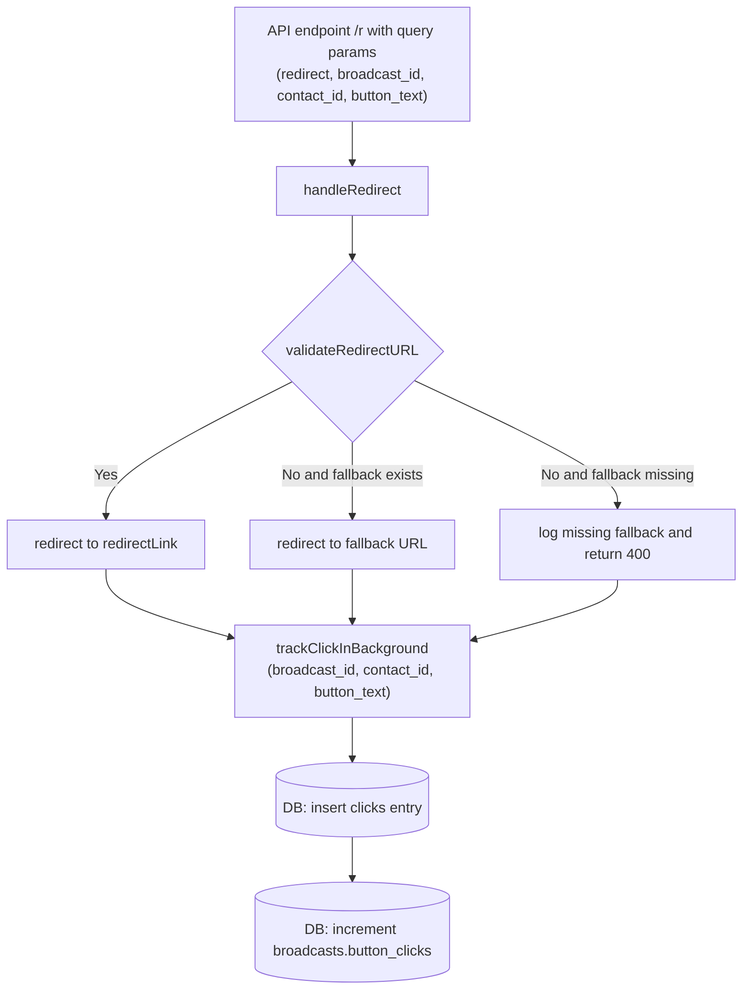

# Redirect Server Design

## Purpose
This project exposes a single redirect endpoint that validates an incoming URL, redirects the user immediately, and logs click metadata in the database in the background.

## API Contract

### Endpoint
`GET /r`

### Query Parameters
| Name | Required | Type | Description |
| --- | --- | --- | --- |
| `redirectLink` | No | string | Target destination URL to redirect the user to. Must be a valid `http` or `https` URL. |
| `data` | No | string | Formatted string containing `${broadcastId}_${contactId}` or `{${broadcastId}_${contactId}}`. |
| `button_text` | No | string | Text of the clicked button, used for logging. |
| `broadcast_id` | No | UUID string | (Fallback) Broadcast identifier used for tracking the click if `data` is missing. |
| `contact_id` | No | UUID string | (Fallback) Contact identifier used for tracking the click if `data` is missing. |

### API Input Example
```text
/r?redirectLink=https%3A%2F%2F5g0mwy-zq.myshopify.com&button_text=Shop%20Now&data={11111111-1111-1111-1111-111111111111_22222222-2222-2222-2222-222222222222}
```

### API Expected Return
The API does not return JSON.

- If `redirectLink` is valid, the user is redirected to that URL with HTTP `302`.
- If `redirectLink` is invalid, the user is redirected to `DEFAULT_FALLBACK_URL` with HTTP `302`.
- If `redirectLink` is invalid and `DEFAULT_FALLBACK_URL` is not configured, the click is still tracked and the API returns HTTP `400`.

### API Response Example
```text
HTTP/1.1 302 Found
Location: https://example.com
```

## Function Contract

### `handleRedirect(req, res)`
Defined in `src/handleRedirect.js`.

#### Input
- `req`: Express request object
- `res`: Express response object

#### Expected Behavior
- Reads query parameters from `req.query`
- Validates `redirectLink`
- Redirects to `redirectLink` when valid
- Redirects to `process.env.DEFAULT_FALLBACK_URL` when invalid
- Logs fallback usage to the console
- Calls `trackClickInBackground(...)` without awaiting it so redirect latency stays low
- If no fallback URL is configured, still records the click and returns `400`
- Runs asynchronously without blocking the redirect response

#### Return
- No explicit return value on success
- Returns an Express `400` response only when no fallback URL is configured

### `isValidHttpUrl(string)`
Defined in `src/isValidHttpUrl.js`.

#### Input
- `string`: value to validate as a URL

#### Expected Behavior
- Returns `true` for valid `http://` or `https://` URLs
- Returns `false` for missing, malformed, or unsupported URLs

#### Return
- `boolean`

### `trackClickInBackground({ broadcastId, contactId, buttonText })`
Defined in `src/trackClickInBackground.js`.

#### Input
- `broadcastId`: UUID string for the broadcast
- `contactId`: UUID string for the contact
- `buttonText`: text of the button clicked

#### Expected Behavior
- Validates `broadcastId` and `contactId`
- Checks that the broadcast and contact exist in the database
- Inserts a new row into the `clicks` table
- Increments `broadcasts.button_clicks` by 1 for the matching broadcast
- Logs success or validation failures to the console
- Runs after the redirect has already been sent to the user

#### Return
- `Promise<void>`
- Resolves when the click has been processed or skipped
- Rejects only on unexpected database or runtime errors

### `db.js`
Defined in `config/db.js`.

#### Input
- Reads environment variables from `.env`

#### Expected Behavior
- Creates a shared PostgreSQL `pool`
- Exposes a single database connection pool for the project

#### Return
- `pool` instance from `pg`

## Database Side Effect

### Table Write
The background tracking function inserts into the `clicks` table and increments the matching broadcast's `button_clicks` counter.

### Inserted Columns
- `broadcast_id`
- `contact_id`
- `button_clicked`

### Counter Update
The background tracking function also increments the broadcast counter.

```sql
UPDATE broadcasts
SET button_clicks = COALESCE(button_clicks, 0) + 1
WHERE broadcast_id = $1;
```


## Activity Diagram



## Notes
- Redirect happens immediately so the user is not delayed by database work.
- Click tracking is intentionally fire-and-forget.
- The fallback URL should be configured in `DEFAULT_FALLBACK_URL`.
- Click tracking still runs even when no fallback URL is configured.
